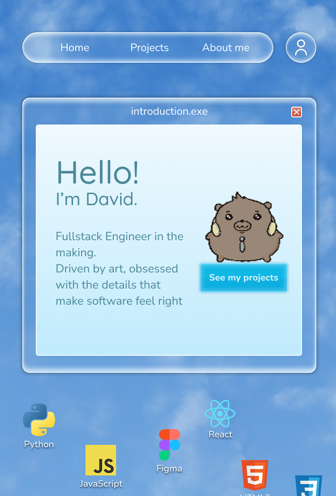

---

### About Me

- Computer Engineering student at **Tecnológico de Costa Rica (TEC)**, Cartago 
- Working toward becoming a **Full-Stack Developer**, with a growing focus on cloud (AWS) and AI
- Artistic at heart - I care as much about how something *looks and feels* as how it works
- Passionate gamer and game developer - I love building and exploring interactive worlds
- Constantly learning: right now that's AWS, Figma, and going deeper into React
- Driven by curiosity - I enjoy understanding how things work well enough to build them myself
- Reach me on **[LinkedIn](https://www.linkedin.com/in/jdavid-espinoza)**

---

### Tech Stack

**Languages & Frameworks**

  
  
  
  
  
  

**Databases & Tools**

  
  
  
  
  
  

**Game Dev**

  

**Currently Learning**

  
  

---

### Currently Working On

<table>
  <tr>
    <td width="55%" align="center">
      
    </td>
    <td width="45%">
      <h3>Uminori</h3>
      
A cozy 3D exploration game set on quiet islands surrounded by the sea. Retro, low-res look. More to come...

      
<b>Built with:</b> Unity · C# · Shader Graph

      
    </td>
  </tr>
  <tr>
    <td width="55%">
      <h3>Portfolio 2.0</h3>
      
Rebuilding my personal portfolio from scratch with a retro-desktop aesthetic. Currently designing in Figma, development starts next.

      
<b>Built with:</b> Figma · React · TypeScript · HTML5 · CSS3

      
    </td>
    <td width="45%" align="center">
      
    </td>
  </tr>
</table>

---

*"Code, design, games. usually all three at once, and i love it."*

